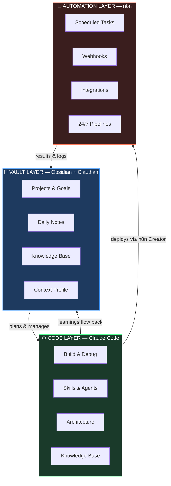

# Second Brain × Claude Code

> The combination of Superpowers and Get Shit Done — a framework that turns Obsidian + Claude Code + n8n into one unified AI-powered system running entirely on your machine.

---

> *"I have no IT education, no coding skills, no system administration background. None. Four months ago I was using AI the same way most people do — ask a question, get an answer, move on. This is what happened next."*
>
> — [Read the full story →](STORY.md)

---

## The Problem This Solves

Every developer working with AI eventually hits the same question:

**"Should I use Claude for this — or n8n?"**

The answer is: **both, and they should know about each other.**

- Claude Code thinks, plans, and builds. It handles complexity, logic, and anything that needs judgment.
- n8n runs 24/7 without you. It handles recurring tasks, scheduled automations, and integrations between tools.

This framework wires all three layers together into one coherent system — and it runs **completely on your own machine**. No cloud lock-in, no subscription beyond Claude itself.

---

## Superpowers + Get Shit Done

Most productivity systems are great at one thing. This framework combines two:

**Superpowers (Vault Layer)** — Strategic thinking. Claudian is your named AI assistant inside Obsidian: project manager, knowledge curator, thinking partner. You plan, decide, and remember here.

**Get Shit Done (Code + Automation Layer)** — Execution. Claude Code builds and ships. n8n runs it forever. The Skills and Agents do the heavy lifting so you stay in flow.

The vault feeds context into execution. Execution feeds learnings back into the vault. The system grows with you.

---

## Three Layers, One System



**The vault plans and manages → Claude Code builds and delivers → n8n runs it forever.**

All three layers know each other through a shared Knowledge Base and Skill Files.

---

## How It Works — No Installation Required

> **This is not traditional software. There is nothing to install or compile.**

The framework is built entirely from configuration files that Claude reads natively. The Markdown files *are* the code.

### What happens when you set it up:

**Vault Template** → Open the `vault-template/` folder in Obsidian as a new vault. Claude reads `CLAUDE.md` automatically and becomes Claudian — your personal vault AI with consistent behavior, session routines, and memory.

**Workspace Template** → Open the `workspace-template/` folder in Claude Code (`claude` command). Claude reads `CLAUDE.md` and all `.claude/rules/` files on startup. The Skills in `skills/` are available immediately — type `/n8n-creator` or `/security-agent` and they activate.

**Skills** → Each `.skill.md` file defines how Claude behaves for a specific task type. No Python, no JavaScript. Claude reads the file and acts accordingly. You can read every skill in plain English and understand exactly what it does.

**The result:** Fork → place on your machine → open in Obsidian and Claude Code → run onboarding once → fully personalized system in ~10 minutes.

---

## Claude vs. n8n — When to Use Which

| Use Claude Code | Use n8n (via n8n Creator skill) |
|----------------|--------------------------------|
| Complex logic & custom code | Recurring scheduled tasks |
| Architecture decisions | Webhook-triggered automations |
| One-time research & analysis | SaaS-to-SaaS integrations |
| Interactive development | "Make this run automatically" |
| Anything requiring judgment | Event-driven pipelines |

**The n8n Creator skill** takes you from requirements to live deployed workflow in one session — requirements → design → build → validate → deploy → activate.

---

## Quick Start

### Prerequisites
- [Obsidian](https://obsidian.md) — free
- [Claude Code](https://claude.ai/code) — requires Claude subscription
- [n8n](https://n8n.io) — optional, for automation deployment (self-hosted or cloud)

### Setup (10 minutes)

1. **Clone** this repository to your machine
   ```bash
   git clone https://github.com/marcgarding54-create/second-brain-x-claude-code.git
   ```

2. **Vault** → Open Obsidian → "Open folder as vault" → select `vault-template/`

3. **Workspace** → Open a terminal in `workspace-template/` → run `claude`

4. **Onboarding** → In Obsidian, open `ONBOARDING.md` and tell Claude: *"Start onboarding"* — 5 questions, fully personalized in ~10 minutes

5. **Optional: n8n** → Add your n8n instance URL + API key to Claude Code's MCP config to enable workflow deployment

That's it. The system is running on your machine.

---

## Structure

```
second-brain-x-claude-code/
├── vault-template/        ← Open in Obsidian
│   ├── CLAUDE.md          ← Claudian identity & vault rules
│   ├── ONBOARDING.md      ← Personalization flow
│   ├── 00 Context/        ← About Me, Tools, Writing Style
│   ├── 02 Projects/       ← Active projects
│   ├── 05 Knowledge Base/ ← Structured long-term memory
│   └── ...
├── workspace-template/    ← Open in Claude Code
│   ├── CLAUDE.md          ← Workspace behavior & agent team
│   ├── .claude/rules/     ← Modular behavior rules
│   └── skills/            ← 8 pre-built agent skill files
└── docs/                  ← Deep-dive documentation
```

---

## Key Features

### Vault Layer
- **Claudian** — Named AI identity for your vault. Consistent behavior, session routines, vault rules.
- **Onboarding Flow** — Interactive 5-step setup that personalizes the system to you in ~10 minutes.
- **Session Routines** — Automatic daily notes, project status updates, and context management.
- **Knowledge Base** — Structured long-term memory with INDEX-first loading (minimal context use).

### Code Layer
- **8 Pre-built Skills** — security, QA, research, frontend, architecture, backend, Supabase, and **n8n Creator**.
- **Subagent Team Model** — Orchestrator + specialist agents with clear model selection (haiku/sonnet/opus).
- **Rules System** — Modular `.claude/rules/` files for consistent behavior across sessions.

### Automation Layer (n8n Creator)
- **Full deploy pipeline** — From natural language requirements to live n8n workflow in one session.
- **7 specialized sub-skills** — Workflow patterns, MCP tools, validation, node config, expressions, JS/Python code nodes.
- **2,700+ templates** — Search and deploy existing n8n templates directly via MCP.
- **Validation-first** — Every workflow validated before deployment.

---

## Documentation

- [Philosophy](docs/philosophy.md) — Why this three-layer combination works
- [Setup Guide](docs/setup-guide.md) — Detailed setup instructions
- [n8n Integration](docs/n8n-integration.md) — The automation layer deep-dive
- [Vault Layer](docs/vault-layer.md) — How the vault PM system works
- [Code Layer](docs/code-layer.md) — How the Claude Code workspace works
- [Skill System](docs/skill-system.md) — How Skills work and how to create new ones

---

## Contributing

Built something new? Skills, patterns, and improvements flow back into the framework.
See [CONTRIBUTING.md](CONTRIBUTING.md) for the exact steps — including how to generalize personal skills for the framework.

---

## License

MIT — Fork, adapt, build on top.
