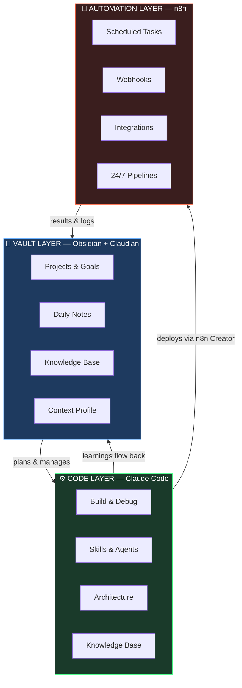

# Second Brain × Claude Code

> A reproducible framework that turns Obsidian + Claude Code + n8n into a unified AI-powered system — for thinking, building, and running automations 24/7.

## The Problem This Solves

Every developer working with AI eventually hits the same question:

**"Should I use Claude for this — or n8n?"**

The answer is: **both, and they should know about each other.**

- Claude Code thinks, plans, and builds. It handles complexity, logic, and anything that needs judgment.
- n8n runs 24/7 without you. It handles recurring tasks, scheduled automations, and integrations between tools.

This framework wires all three layers together into one coherent system.

---

## Three Layers, One System



**The vault plans and manages → Claude Code builds and delivers → n8n runs it forever.**

All three layers know each other through a shared Knowledge Base and Skill Files.

---

## Claude vs. n8n — When to Use Which

| Use Claude Code | Use n8n (via n8n Creator skill) |
|----------------|--------------------------------|
| Complex logic & custom code | Recurring scheduled tasks |
| Architecture decisions | Webhook-triggered automations |
| One-time research & analysis | SaaS-to-SaaS integrations |
| Interactive development | "Make this run automatically" |
| Anything requiring judgment | Event-driven pipelines |

**The n8n Creator skill** is built into this framework. It takes you from requirements to live deployed workflow in one session — requirements → design → build → validate → deploy → activate.

---

## Quick Start

1. **Fork or clone** this repository
2. **Open `vault-template/`** in Obsidian as a new vault
3. **Open `workspace-template/`** in Claude Code
4. **Read `vault-template/ONBOARDING.md`** and let Claude walk you through setup (~10 minutes)
5. **Configure n8n MCP** in your Claude Code settings (optional — for automation deployment)
6. Start building

---

## Structure

```
second-brain-x-claude-code/
├── vault-template/      ← Open in Obsidian
├── workspace-template/  ← Open in Claude Code
└── docs/                ← Deep-dive documentation
```

---

## Key Features

### Vault Layer
- **Claudian** — Named AI identity for your vault. Consistent behavior, session routines, vault rules.
- **Onboarding Flow** — Interactive 5-step setup that personalizes the system to you in ~10 minutes.
- **Session Routines** — Automatic daily notes, project status updates, and context management.
- **Knowledge Base** — Structured long-term memory with INDEX-first loading (minimal context use).

### Code Layer
- **8 Pre-built Skills** — security, QA, research, frontend, architecture, backend, Supabase, and **n8n Creator**.
- **Subagent Team Model** — Orchestrator + specialist agents with clear model selection (haiku/sonnet/opus).
- **Rules System** — Modular `.claude/rules/` files for consistent behavior across sessions.

### Automation Layer (n8n Creator)
- **Full deploy pipeline** — From natural language requirements to live n8n workflow in one session.
- **7 specialized sub-skills** — Workflow patterns, MCP tools, validation, node config, expressions, JS/Python code nodes.
- **2,700+ templates** — Search and deploy existing n8n templates directly via MCP.
- **Validation-first** — Every workflow validated before deployment.

---

## Documentation

- [Philosophy](docs/philosophy.md) — Why this three-layer combination works
- [Setup Guide](docs/setup-guide.md) — Detailed setup instructions
- [n8n Integration](docs/n8n-integration.md) — The automation layer deep-dive
- [Vault Layer](docs/vault-layer.md) — How the vault PM system works
- [Code Layer](docs/code-layer.md) — How the Claude Code workspace works
- [Skill System](docs/skill-system.md) — How Skills work and how to create new ones

---

## Contributing

Built something new? Skills, patterns, and improvements flow back into the framework.
See [CONTRIBUTING.md](CONTRIBUTING.md) for the exact steps — including how to generalize personal skills for the framework.

---

## License

MIT — Fork, adapt, build on top.
